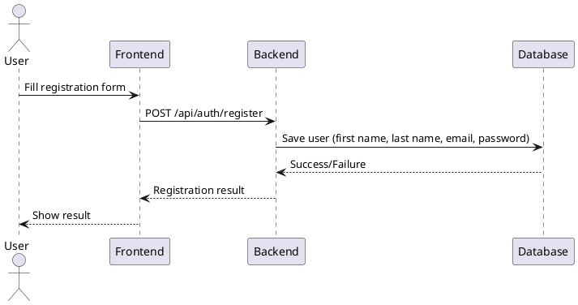
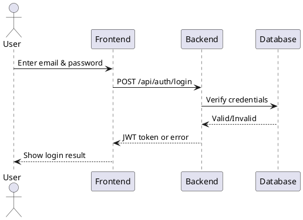
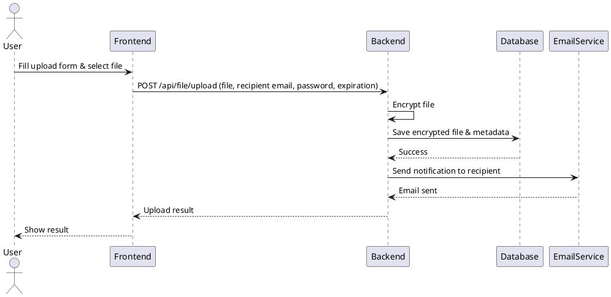
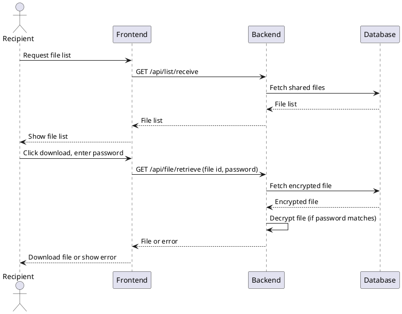
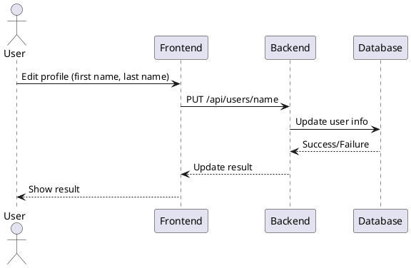
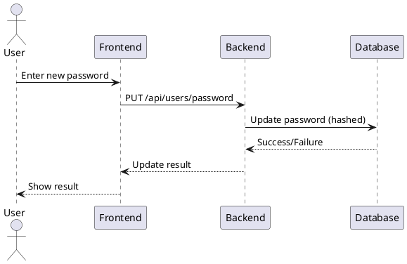
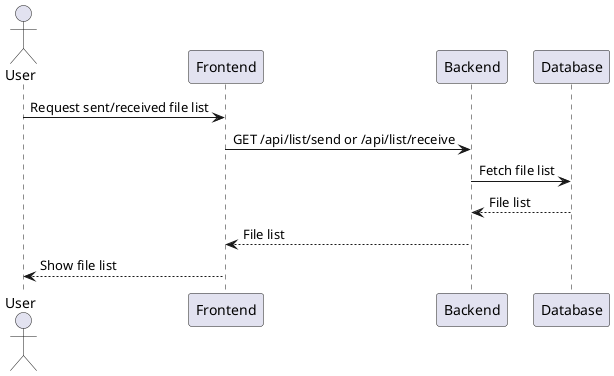

# Sequence Diagrams and Data Flow

This document provides UML sequence diagrams for the main flows in the Secure File Sharing project, covering both backend and frontend interactions.

---

## 1. User Registration

---

## 2. User Login

---

## 3. File Upload & Share

---

## 4. File Download (Recipient)

---

## 5. Update User Profile

---

## 6. Change Password

---

## 7. File Listing (Send/Receive)

---

*End of Data Flow and Sequence Diagrams*
